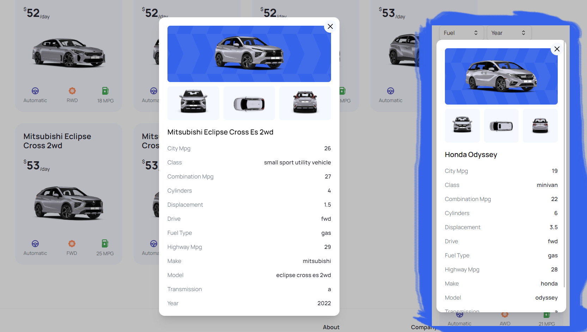

# Next13-CarHub-Application
## Welcome! 👋

Thanks for checking out this Application.

## Overview
Simplify your reading with Summize, an open-source article summarizer that transforms lengthy articles into clear and concise summaries

### Links

- App URL: [Github](https://github.com/shaheen7a/Next13-CarHub-Application)
- APK Link: [Vercel](https://next13-car-hub-application-2001.vercel.app/)

## My process

### Built with

- Next JS 13
- Tailwind

- JSX

## Author

- Linkedin - [@aous-shaheen-381636221](https://www.linkedin.com/in/shaheen2001/)
- Facebook - [@aoushaheen7](https://www.facebook.com/shaheen72001/)

By me 🚀🚀🚀

